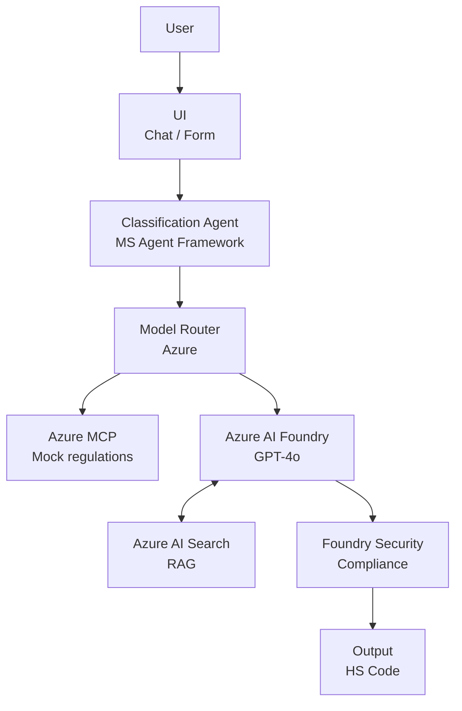

# AI Tariff Agent

## Week 1: Definition and Setup

## Description
AI agent for tariff classification (HS Code).  
This project is developed as part of the Hackathon AI Dev Days 2026.

## MVP Goal
Receive a product description and return a suggested HS Code.

## Project Plan
- Week 1: Definition and Setup
- Week 2: Agent Construction
- Week 3: Security and Scalability
- Week 4: Demo and UX
- Week 5: Final Delivery

## Getting Started
```bash
git clone https://github.com/fernando-pedernera/ai-tariff-agent.git
cd ai-tariff-agent
```

## Architecture (Conceptual) 

We have a conceptual agent that receives a description and provides a suggested HS Code. This is the first step toward a fully functional system.



---

## Diagram Explanation

The following diagram illustrates the information flow of our AI Agent for tariff classification:

1.  **User Input:** The user provides a product description through a simple UI (Chat/Form).
2.  **Orchestration:** The **Classification Agent** orchestrates the reasoning process using **Microsoft’s agent framework**.
3.  **Model Routing:** A **Model Router** ensures scalability and directs requests efficiently.
4.  **Reasoning & Regulations:** * Reasoning is powered by **GPT-4o**.
    * External regulations are simulated via **Azure MCP**.
5.  **Normative Memory:** **Azure AI Search (RAG)** provides the necessary external normative memory by retrieving relevant customs documentation.
6.  **Security Layer:** **Microsoft Azure AI Foundry** (Security Layer) ensures compliance, safety, and enterprise readiness.
7.  **Result:** Finally, the system outputs a **suggested HS Code** to the user.